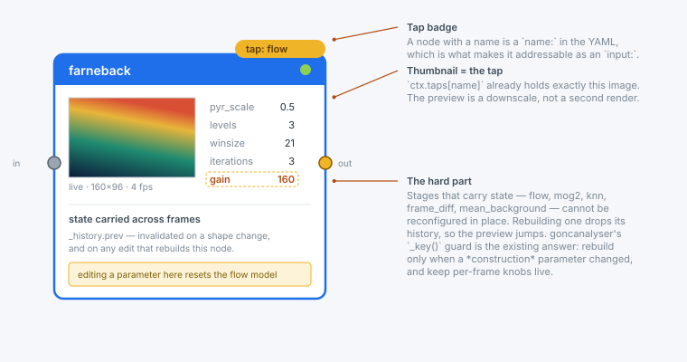
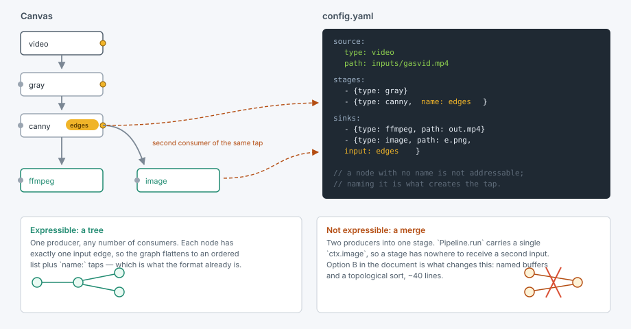
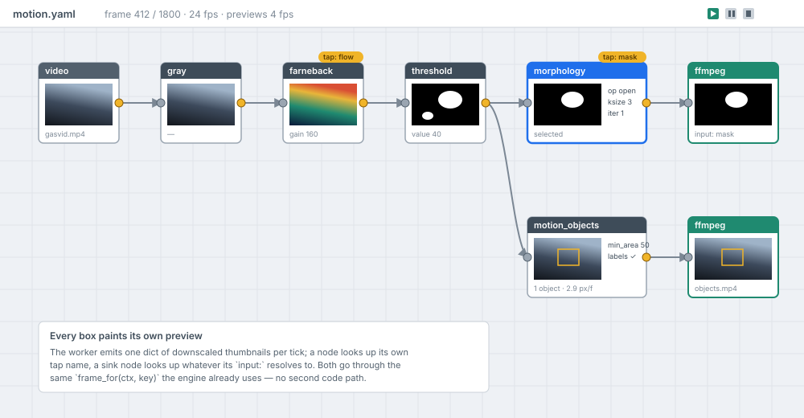
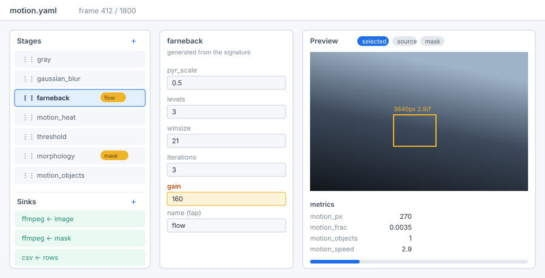

# Evaluating a node-based config editor for segmentator

**What this is.** An evaluation, not a proposal to build. It prices four ways to
put an Orange3-style visual editor in front of segmentator's YAML configs, with a
live preview on every node and on every sink, and says which one is worth doing.
No GUI code was written.

**Requirements taken as given.** PyQt6, consistent with goncanalyser. The editor
authors configs *and* previews them live. Where a config has several sinks — the
commented-out block in `configs/baseline.yaml` is the case to hold in mind, four
sinks watching four different points in one chain — each sink box shows its own
preview.

**The short answer.** The live-preview requirement is nearly free: `ctx.taps` and
`frame_for()` already are the per-node preview channel. The node *graph* is the
expensive part, and it is expensive for a reason worth knowing before spending
the money — segmentator's config is a linear chain with named taps, so a node
canvas mostly draws a straight line. If the Orange3 look is itself the goal,
hand-rolled `QGraphicsScene` is the pick. If the goal is "author these configs
comfortably with a preview", the list-and-form editor gets there for a third of
the work.

---

## 1. What the engine already gives you

Three things in `segmentator/pipeline.py` do most of a GUI's job, and it is worth
being precise about them because they change the estimates below.

**`ctx.taps` is the preview channel.** A stage given a `name:` has its output
snapshotted after it runs. That is exactly, and already, "the image at this node":

```python
for stage in self.stages:
    stage.apply(ctx)
    name = getattr(stage, "name", None)
    if name is not None:
        ctx.taps[name] = ctx.image
```

A GUI node maps one-to-one onto a named stage. A worker that downscales
`ctx.taps` once per tick and emits `dict[str, QImage]` gives every node box its
picture, with no second render and no second code path.

**`frame_for()` is the sink preview.** Sink boxes are not a special case — a sink
already declares what it consumes as `input:`, and `frame_for(ctx, key)` already
resolves that against `image`, `source`, the taps and the store. The sink node
paints `frame_for(ctx, sink.input)`. Four sinks watching four points of one chain
is four dictionary lookups.

**`build()` and `registered()` are the node palette.** `registered("stage")`
returns all 41 names; `inspect.signature` on the registry class gives each one's
parameters, defaults and type hints. The palette and the parameter form are
generated, not maintained — adding a stage adds a node.



## 2. What the engine does not give you

### 2.1 The config is a tree, not a DAG

`Pipeline.run` carries one `ctx.image` down an ordered list. A stage therefore has
exactly one input, and a node canvas over this config can draw a *tree* — one
producer, many consumers — but never a *merge*, two producers into one stage.



This matters more than it sounds, because a merge is the operation people reach a
node editor *for*: mask this frame by that other branch, difference two
preprocessing variants, composite an overlay onto a differently-processed base.
Today the `select` stage covers the common case by rebinding `ctx.image` from a
tap, which is a tree traversal written as a straight line. It is not a merge.

So there are two honest options:

**(A) Keep the config linear.** The editor forbids multi-input connections. Zero
engine change. The canvas is a tree, `name:` on a node creates the tap, sink nodes
carry `input:`, and round-tripping is a direct mapping. The editor is then drawing
a mostly-straight line and its main value is the preview, not the topology.

**(B) Make the config a DAG.** Give stages an `input:` too, have `Pipeline.run`
keep a dict of named buffers instead of one `ctx.image`, and topologically sort.
Roughly 40 lines in `pipeline.py`, plus a decision about what `ctx.store` and
`ctx.rows` mean when two branches both write `contours`. This is what makes a node
editor pay for itself.

**Recommendation:** if a node editor is actually built, do (B) first. Building (A)
means paying for a graph canvas and then forbidding the thing graphs are for.

### 2.2 The source is forward-only

`VideoSource.__iter__` reads to the end and stops. Live tuning means scrubbing,
stepping back, and re-rendering a paused frame — all of which need
`FrameSource.read(index)` from `goncanalyser/core/source.py`, including its
sequential fast path (setting `CAP_PROP_POS_FRAMES` per frame forces a keyframe
hunt and re-decode, many times slower than reading ahead). That file is already
written; it needs porting, not designing.

### 2.3 Two motion rules come back

The README notes that goncanalyser's `MotionState` rules 1 and 2 do not port,
because a batch run is a single forward pass. A GUI reintroduces both, and they
are not cosmetic:

- **The same frame twice must not advance a model.** Dragging a slider while
  paused re-analyses the frame on screen, over and over. Feed MOG2 the same image
  fifty times and it learns that image *as the background* — the plume you are
  tuning fades out while you tune it.
- **A jump resets.** Seeking or stepping backwards means the previous frame is no
  longer the previous frame, and differencing across the jump lights up the whole
  image.

- **A changed model resets.** Editing a *construction* parameter — `history`,
  `winsize`, `gain` — means a new stage instance and a lost history. goncanalyser's
  `_key()` guard is the existing answer: rebuild only on construction parameters,
  and keep per-frame knobs (thresholds, kernel sizes) live so a paused frame
  re-renders as you drag them. Which of segmentator's parameters are which is a
  per-stage fact the GUI has to encode; `inspect.signature` cannot tell them apart.

Budget this as real work, not polish. It is the difference between a preview that
can be trusted and one that quietly lies.

### 2.4 Cost control

HOG is 150–300 ms on a 640x512 frame — slower than a frame arrives. Farneback and
SIFT are not far behind. A preview that renders every node at full rate will not
keep up, so: emit thumbnails on a `QTimer` coalescer at ~4 fps rather than
per-frame, downscale to ~160 px inside the worker (not on the GUI thread), and
skip nodes scrolled out of view. None of this is hard; all of it has to be decided
before the first `QThread`, because retrofitting a coalescer into a per-frame
signal is a rewrite.

## 3. The four options



### Option 1 — `orange-canvas-core`

The library Orange3's own canvas is built on, published separately and
pip-installable. Gives the real thing: canvas scene, node and link items, a widget
registry, the scheme document model, save/load, undo, and a signal-based execution
model where each node is a widget with typed input/output channels.

That execution model is a genuinely good fit for per-node preview — it is
*designed* around nodes that own a widget and push outputs downstream. It is also
the largest conceptual footprint of the four: you write a `WidgetDescription` per
stage, live inside its scheme model, and translate its `.ows` XML to and from YAML.

- **Risk to check first, not assume:** it uses AnyQt to abstract over Qt bindings,
  and PyQt6 support needs verifying against the version you would actually pin.
  Much of the API is documented thinly or not at all.
- **Verdict:** the most Orange3-like answer, and the right one only if you want
  Orange3's workflow model, not merely its look.

### Option 2 — `NodeGraphQt`

A purpose-built Qt node editor: nodes, ports, bezier links, a property bin, JSON
serialisation, undo, context menus. Far lighter than option 1 and the fastest path
to a canvas that looks right.

- No execution model at all — the run loop, the worker and the YAML mapping are
  yours.
- Per-node live thumbnails are not a first-class feature; you embed a
  `QGraphicsProxyWidget` or paint into a custom node item.
- It is PySide-oriented. A shim is possible, but "consistent with goncanalyser"
  was a stated requirement and this is the option that fights it.
- **Verdict:** good library, wrong binding for this repo.

### Option 3 — hand-rolled `QGraphicsScene`

Node items, port items, bezier links, rubber-band selection, pan and zoom,
hit-testing, an undo stack. Roughly 700–1000 lines, and none of it clever.

- Native PyQt6, no shim, no third-party API to fight.
- The hard requirement — a live thumbnail inside every box — becomes the easy
  part: a `QGraphicsPixmapItem` inside the node item, or a `QGraphicsProxyWidget`
  wrapping a `QLabel`.
- You own the boring parts too: snapping, z-order, link routing, selection
  semantics, keyboard handling.
- **Verdict:** the pick if the Orange3 *look* is the requirement. It is the only
  candidate that is unambiguously PyQt6-native and puts the preview requirement in
  the easy column.

### Option 4 — no node editor: list and generated form

A reorderable `QListWidget` of stages, a parameter form generated from
`inspect.signature` of the registered class, and a preview pane with tabs for the
selected node, the source, and each sink. Roughly 300–400 lines, no new
dependency.



- The config is a linear list, so **a list is the graph**, drawn at 1:1 rather
  than as a straight line of boxes on a canvas.
- Reordering is drag-and-drop on a list, which is a solved widget rather than a
  routing problem.
- Ceiling, stated plainly: it cannot *show* a branch. A `select` stage or a sink
  reading a tap appears as a named reference, not as a visible second edge.
- **Verdict:** the honest lazy option, and the recommendation for a v1.

### Summary

| | Free | You build | PyQt6 | Rough size |
|---|---|---|---|---|
| **1. orange-canvas-core** | canvas, registry, scheme model, save/load, undo, execution | `.ows` ↔ YAML, a `WidgetDescription` per stage, the preview plumbing | via AnyQt — **verify** | ~600 lines + a large API to learn |
| **2. NodeGraphQt** | nodes, ports, links, property bin, JSON, undo | execution, per-node thumbnails, YAML mapping | PySide-oriented; needs a shim | ~500 lines + binding friction |
| **3. Hand-rolled QGraphicsScene** | nothing | items, ports, links, pan/zoom, undo, everything | native | ~700–1000 lines |
| **4. List + generated form** | nothing | list, form, preview pane | native | ~300–400 lines |

All four additionally need the shared work of §2: the seekable source port
(~150 lines), the `QThread` worker with coalesced thumbnail emission (~200 lines),
and the construction-vs-live parameter classification per stage (~100 lines,
spread across the stage modules). **That shared half is the same in every column,
and it is the half that decides whether the preview is trustworthy.** It is also
the half worth building first — it is useful under option 4 and mandatory under
the other three.

## 4. Recommendation

1. **Build the shared half first** — seekable source, worker, coalesced previews,
   parameter classification. It is required by every option and is the part with
   the real engineering risk in it.
2. **Ship option 4 on top.** It authors and previews these configs, including
   per-sink previews, for roughly a third of the work of a canvas.
3. **Revisit the canvas once (B) is done.** If merges become expressible, a node
   editor stops being decoration and starts being the only reasonable way to see
   the pipeline. At that point, option 3 — or option 1, if Orange3's workflow model
   is wanted rather than its appearance.

The thing not to do is build a graph canvas over a config format that cannot hold
a graph. That buys the Orange3 look and, at the same time, an editor whose central
gesture — dragging a second wire into a node — has to be refused.

## 5. Open questions

- Does the workflow need merges at all, or is "one chain, several outputs" the
  actual shape of every pipeline you write? This decides options (A)/(B) and with
  them most of the cost.
- Should the editor run pipelines to completion (batch, progress bar) or only
  preview? Batch execution in-GUI needs cancellation and a second worker.
- Round-tripping: must a hand-edited YAML — comments and all — survive a load and
  save? PyYAML's `safe_load` drops comments, and `configs/*.yaml` are heavily
  commented on purpose. Preserving them means `ruamel.yaml`, and it is much easier
  to decide that now than after the first config is silently stripped.
