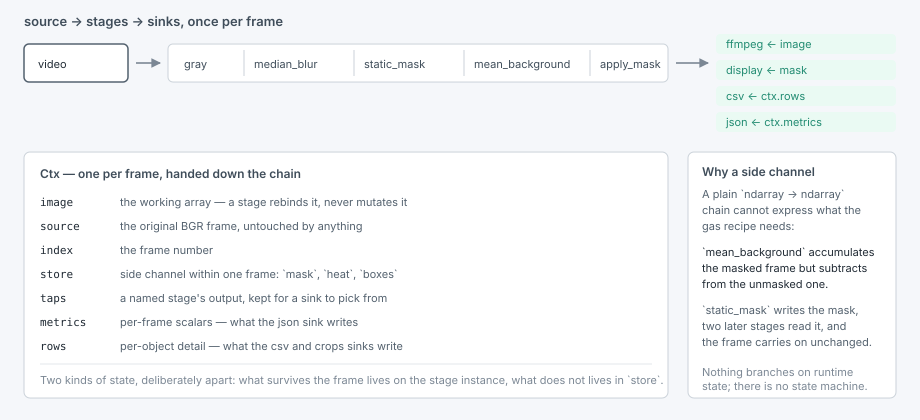
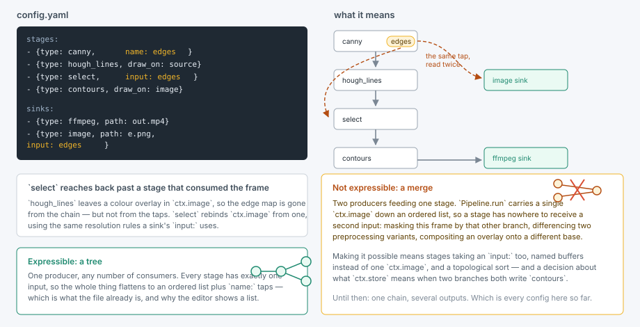

# Escrevendo um config

**O que é isto.** O formato do arquivo: do que um pipeline é feito, como um sink
escolhe o que escreve, e a única forma que o formato não consegue expressar.
Tudo aqui se aplica igualmente a uma execução em lote e a [o editor](gui.md).

Um pipeline é `source → stages → sinks`. Stages são uma lista ordenada aplicada
a cada frame; nada ramifica com base em estado de execução, então não há
máquina de estados — o único "estado" é aquecimento-de-fundo vs. estável, que
`BackgroundModel.ready` trata com um `if`.

```yaml
name: baseline

source:
  type: video
  path: inputs/gasvid.mp4

stages:
  - {type: gray}
  - {type: median_blur, ksize: 7, name: smoothed}
  - {type: static_mask, threshold: 127}
  - {type: mean_background, n_frames: 60}
  - {type: apply_mask, name: masked}

sinks:
  - {type: ffmpeg, path: outputs/result.mp4}
  - {type: display, input: source}
```

Cada entrada é um mapeamento `{type: ..., **params}`. `type` escolhe a classe
registrada, o resto são seus argumentos de construtor, e um nome desconhecido
lança um erro com a lista dos nomes conhecidos. Não há schema a manter
sincronizado: o construtor *é* o schema.

## O contexto



```python
@dataclass
class Ctx:
    image: np.ndarray   # working array; stages rebind it
    source: np.ndarray  # original BGR frame, untouched
    index: int
    store: dict         # side channel within one frame
    taps: dict          # named stages' outputs, for sinks to pick from
    metrics: dict       # per-frame scalars, what the json sink writes
    rows: dict          # per-object detail, what the csv and crops sinks write

class Stage(Protocol):
    def apply(self, ctx: Ctx) -> None: ...

class Sink(Protocol):
    def write(self, ctx: Ctx) -> bool: ...   # False stops the run
    def close(self) -> None: ...
```

Dois tipos de estado, deliberadamente mantidos separados:

| Estado | Vive em | Exemplo |
|---|---|---|
| Entre frames | a instância do stage | `StaticMask.mask`, `MeanBackground._model`, `Farneback._history` |
| Dentro de um frame | `ctx.store` | `store["mask"]` escrito por `static_mask`, lido por `apply_mask` |

Esse canal lateral é o que uma cadeia simples `ndarray -> ndarray` não consegue
expressar: o modelo de fundo médio acumula o frame *mascarado*, mas subtrai do
frame *sem máscara*.

**Contrato para stages:** rebinde `ctx.image`, nunca mude o array no lugar —
`image` e `source` apontam para o mesmo buffer quando um frame entra na cadeia,
e nenhuma cópia defensiva é feita (esses vídeos são grandes o bastante para que
cópias por frame sejam puro desperdício).

## Escolhendo o que um sink produz

Dê a um stage um `name:` para captar sua saída, depois aponte um sink para ele
com `input:`:

```yaml
stages:
  - {type: gray}
  - {type: median_blur, ksize: 7, name: smoothed}
  - {type: static_mask, threshold: 127}
  - {type: mean_background, n_frames: 60}
  - {type: apply_mask, name: masked}

sinks:
  - {type: ffmpeg, path: outputs/result.mp4}                 # default: the final image
  - {type: display, input: source}                           # untouched footage
  - {type: display, input: smoothed}                         # mid-chain
  - {type: display, input: mask}                             # the ROI mask artifact
```

`input:` resolve nesta ordem — `image` (a saída final da cadeia, o padrão),
`source`, o tap de um stage nomeado, depois qualquer entrada com valor de
imagem em `ctx.store`. Qualquer outra coisa lança um erro, listando o que está
disponível. Sinks de exibição nomeiam sua janela a partir de `input`, a menos
que recebam um `window:`, então vários deles coexistem em vez de disputar uma
janela.

Taps são opcionais: um stage sem nome não custa nada, e um `name:` duplicado é
rejeitado.

> **Pegadinha:** um tap guarda `ctx.image` *depois* que o stage rodou.
> `static_mask` publica uma máscara mas deixa o frame intacto, então um `name:`
> nele capta sua imagem de entrada — alcance a máscara em si com `input: mask`.

## Ramificando com `select`



Um stage que desenha consome o frame de trabalho. `select` alcança para trás,
usando as mesmas regras de resolução do `input:` de um sink:

```yaml
- {type: canny, name: edges}
- {type: hough_lines, draw_on: source}   # leaves a colour overlay in ctx.image
- {type: select, input: edges}           # …so reach back to the edge map
- {type: contours, draw_on: image}
```

Isso basta para uma *árvore* — um produtor, vários consumidores. Não basta para
uma *fusão* — dois produtores alimentando um stage —, algo que o formato de
config não consegue expressar. Mascarar este frame por aquela outra
ramificação, diferenciar duas variantes de pré-processamento, compor uma
sobreposição em cima de uma base processada de outro jeito: tudo isso exigiria
que stages recebessem seu próprio `input:`, um dicionário de buffers nomeados
em vez de um único `ctx.image`, e uma ordenação topológica — além de uma
decisão sobre o que `ctx.store` significa quando duas ramificações escrevem
`contours` ao mesmo tempo.

## Executando

```bash
uv run segmentator configs/baseline.yaml
uv run segmentator configs/mog2_contours.yaml --video inputs/gasvid1.mp4 --max-frames 300
```

`--video` e `--output` sobrescrevem o caminho da fonte e o caminho do primeiro
sink ffmpeg para uma execução; `--max-frames` interrompe antecipadamente. Mais
nada em um config é sobrescrevível pela linha de comando, de propósito — uma
execução que difere em mais do que sua entrada e sua saída é um config
diferente, e configs são baratos.

## Compondo em Python

O construtor de `Pipeline` já compõe, então não há classe builder:

```python
from segmentator.io import DisplaySink, VideoSource
from segmentator.pipeline import Pipeline
from segmentator.stages.motion import Mog2
from segmentator.stages.preprocess import GaussianBlur, Gray, Threshold

with Pipeline(
    VideoSource("inputs/gasvid1.mp4"),
    [Gray(), GaussianBlur(ksize=9), Mog2(history=200), Threshold(value=128)],
    [DisplaySink()],
) as pipeline:
    pipeline.run(max_frames=300)
```

`Pipeline.apply(ctx)` executa a cadeia para um frame e preenche os taps — o que
`run()` faz por frame, e o que a thread de pré-visualização do editor conduz um
frame de cada vez.
