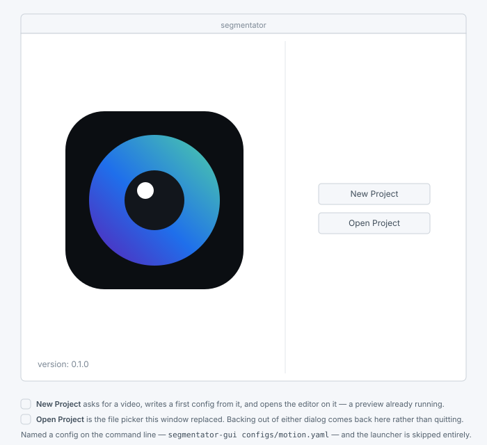
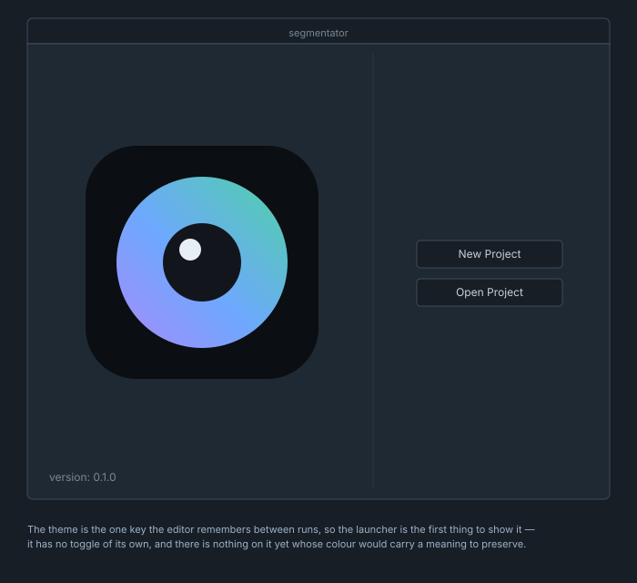
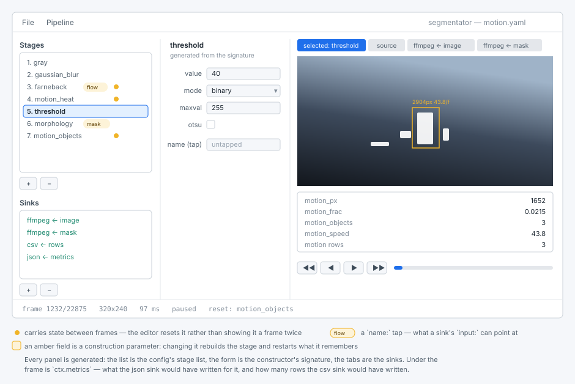
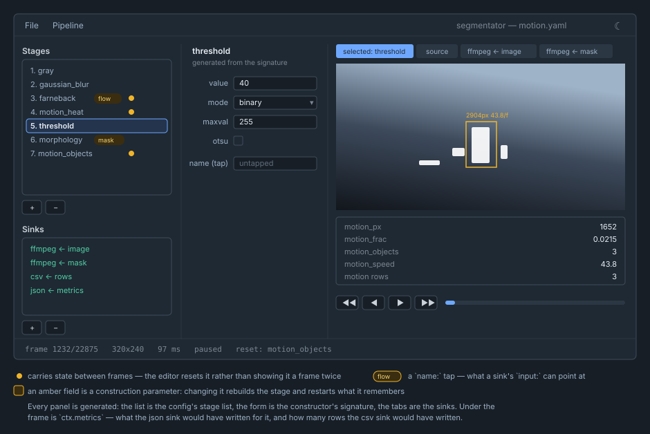
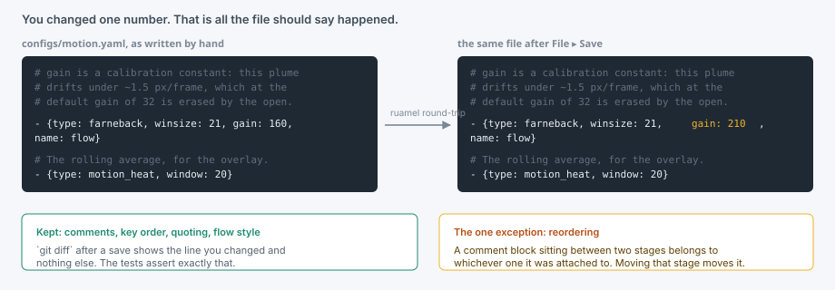
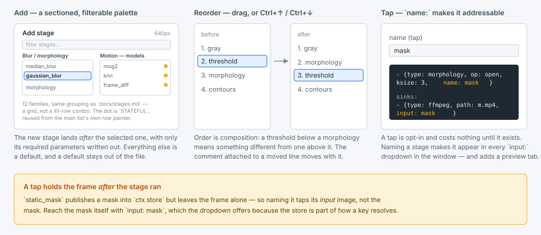
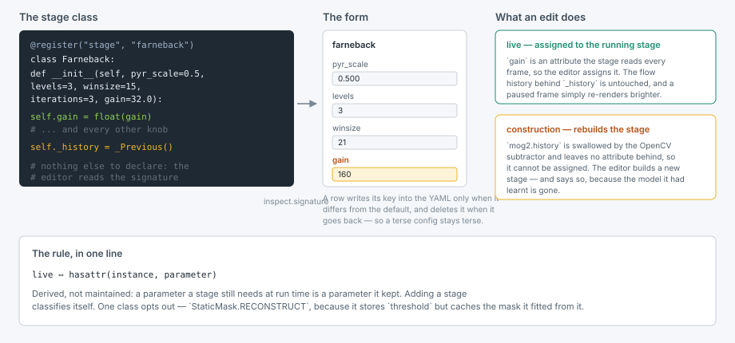
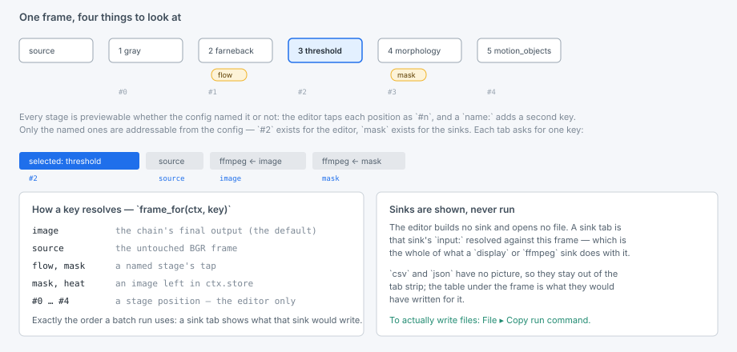
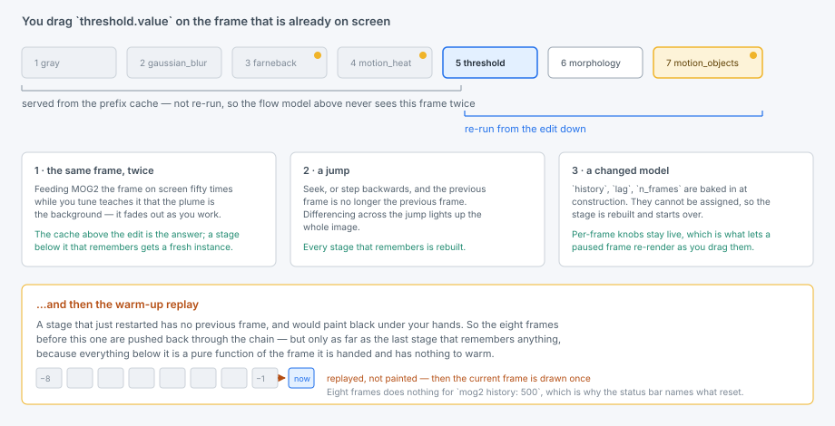

# O editor

**O que é isto.** Uma janela PyQt6 para escrever um desses configs YAML
enquanto se observa o que ele faz, frame a frame. É o mesmo motor — as mesmas
classes de stage, o mesmo `frame_for`, os mesmos números — conduzido um frame
de cada vez em vez de sobre um lote.

```bash
uv sync --extra gui
uv run segmentator-gui configs/motion.yaml
uv run segmentator-gui                       # abre o lançador
```

## Começando do zero

Informe um config e o editor abre direto nele. Não informe nenhum — que é o que
um bundle aberto com dois cliques faz — e você recebe o lançador.



**Open Project** é o seletor de arquivos, mantido. **New Project** é o caminho
que antes não existia: um config é a unidade de trabalho aqui, e até agora a
única forma de chegar ao primeiro era escrever o YAML à mão. Então ele pede a
única coisa sem a qual um config não pode ser escrito — um vídeo — e deriva o
resto, em `configs/` se você estiver rodando de um checkout e ao lado do vídeo
caso contrário. Um bundle congelado começa com o diretório de trabalho em `/`,
onde um `configs/` relativo cairia em algum lugar não gravável e invisível.

O que ele escreve é um sink `display` sobre aquele vídeo, sem stages ainda: o
menor config que é *válido*, para que o editor suba já pré-visualizando em vez
de mostrar uma caixa de erro que você precisa fechar antes de começar. Nada é
sobrescrito — um nome já ocupado ganha um `-2`.



## A janela do editor

O config é uma lista linear de stages, então **a lista é o grafo**, desenhada
1:1 em vez de como uma linha reta de caixas em uma tela. Onde um config de
fato se ramifica, ele se ramifica por *nome* — um stage `select`, ou um sink
lendo um tap — e o editor mostra isso como uma referência nomeada em vez de
uma segunda aresta. O raciocínio por trás dessa escolha, e o que uma tela de
nós teria custado em vez disso, está em
[Por que uma lista e não uma tela](#por-que-uma-lista-e-nao-uma-tela).



Isso não é um esboço do design pretendido — é o que a janela de fato
renderiza. O editor força uma de suas duas paletas próprias e o estilo Fusion
em vez de herdar o tema do desktop. As marcas âmbar são o motivo pelo qual
vale a pena fixar isso: um tap `name:` e um stage que carrega estado entre
frames são as duas coisas que você procura na lista enquanto ajusta, e um
tema que os recolore é um tema que os esconde.

### Dia e noite

O `☀` no canto da barra de menu alterna; o glifo é o tema em que você está,
então `☾` significa noite. A escolha é lembrada entre sessões.



Mesmo layout, mesmos significados. Os dois papéis não simplesmente se
invertem, porque uma paleta que inverte cada canal mecanicamente perde as
coisas pelas quais a paleta clara foi escolhida: o azul clareia, já que
`#1f6feb` em um painel escuro lê como um buraco em vez de um destaque, e a
pílula âmbar vira um tom escuro atrás da mesma borda âmbar — um tap precisa
continuar reconhecível como um tap. O vídeo na pré-visualização nunca é
tematizado. É a filmagem, não a mobília.

## Os três painéis

**Esquerda — o pipeline.** Os stages na ordem em que rodam, depois os sinks.
Um ponto âmbar marca um stage que lembra algo entre frames; uma pílula marca
um tap `name:`. Ambos importam durante o ajuste, e é por isso que estão na
lista em vez de escondidos no formulário.

**Meio — os parâmetros.** Gerado a partir de `inspect.signature` da classe
registrada. Não há formulário por stage para manter: adicionar um stage a
`segmentator/stages/` adiciona seu formulário aqui, com o widget certo por
tipo e os padrões do construtor já preenchidos.

**Direita — a pré-visualização.** Uma aba para cada coisa que vale a pena
olhar: o stage selecionado, a fonte intocada, e cada sink de imagem. Abaixo,
`ctx.metrics` e as contagens de linhas — o que os sinks `json` e `csv`
teriam escrito para este frame.

## Abrindo e salvando

`File ▸ Open` lê um config, `Ctrl+S` o reescreve, `Ctrl+Shift+S` o escreve em
outro lugar. O documento é lido e escrito pelo parser round-trip do ruamel,
não por `yaml.safe_load`, e a diferença é o ponto central: `configs/*.yaml`
são fortemente comentados de propósito, e um salvamento precisa devolver
esses comentários.



Um `git diff` depois de um salvamento mostra as linhas que você mudou e nada
mais — ordem de chaves, aspas, estilo de fluxo e linhas em branco, tudo
sobrevive. A única coisa que não sobrevive é um bloco de comentário entre dois
stages quando você *reordena* um deles: ele pertence a qualquer stage a que o
ruamel o anexou, e se move quando esse stage se move.

## Adicionando, removendo e reordenando stages



`+` abre a paleta — metade da largura da janela principal, organizada como
uma grade de cartões de família (os mesmos doze grupos que
`docs/stages.md` agrupa: Ajuste, Blur / morfologia, Movimento — modelos, e
assim por diante) em vez de uma combo longa. Cada nome nela é
`registered("stage")` ou `registered("sink")` — 43 stages, 3 sources, 6
sinks, listados porque se registraram sozinhos, não porque alguém os digitou
aqui. Cada cartão usa a cor da sua família do [catálogo](stages.md) — azul
para preparar um frame, roxo para encontrar características nele, verde para
mascará-lo, laranja para medir o que se moveu — e lista seus stages na mesma
fonte monoespaçada que o catálogo usa, já que são valores de `type:` para
serem digitados em um config, não prosa. Um stage que carrega estado entre
frames mostra o mesmo ponto âmbar que a lista principal usa, explicado por
uma legenda abaixo dos cartões; um cartão com mais de três stages rola em vez
de crescer, então todo cartão tem o mesmo tamanho não importa o que esteja
arquivado nele. Uma caixa de filtro acima deles estreita todos os cartões de
uma vez, já que uma grade ainda é muito para escanear visualmente atrás de um
nome específico. Clicar em uma linha a seleciona — entre cartões, só uma
linha é selecionada por vez — e um duplo clique aceita imediatamente. O novo
stage é inserido depois do selecionado e escrito apenas com seus parâmetros
*obrigatórios*; tudo o mais é um padrão, e um padrão fica fora do arquivo.

Reordene arrastando dentro da lista, ou com `Ctrl+↑` / `Ctrl+↓`. Ordem é
composição: `canny` seguido de `harris(draw_on: image)` põe os cantos no mapa
de bordas, e os mesmos dois na ordem contrária não faz isso.

`−` (ou `Ctrl+D`) remove qualquer lista que estiver com o foco.

## Otimizando uma cadeia

Uma cadeia ajustada à mão é uma catraca. Entra um stage para corrigir o que está
na tela, um controle é movido, outro stage entra por cima, e nada nunca sai —
o que era essencial três edições atrás pode não contribuir com nada agora.
**Pipeline → Optimize…** procura exatamente isso e oferece remover.

Ele amostra dezesseis quadros distribuídos pela fonte, roda a cadeia sobre eles
e então roda de novo com uma mudança de cada vez, mantendo só as que deixam
**toda saída de sink idêntica** — não a pré-visualização, os sinks. Essa
distinção importa: um sink `csv` observa `ctx.rows` e um `json` observa todo o
`ctx.metrics`, então com qualquer um deles presente um stage que só contribui
com `edge_px` continua sendo saída e não será mexido. Sem nenhum sink, a imagem
final é o que se compara.

Os achados vêm em duas forças, e o diálogo diz qual:

* **provável (provable)** — o argumento não depende dos quadros. Um
  `gaussian_blur` com `ksize: 1`; um stage cuja saída ninguém lê adiante, que é
  o que um `apply_mask` apontado para `source` silenciosamente faz com tudo
  acima dele; uma sequência de stages por pixel (`brightness_contrast`, `gamma`,
  `threshold` sem Otsu) colapsada em um único `lut`, verificada contra os 256
  valores de entrada em vez de amostrada.
* **amostrado (sampled)** — nenhum contraexemplo foi encontrado em dezesseis
  quadros. Isso é falseamento, não prova, e o tamanho da amostra não é
  formalidade: na cadeia contra a qual isto foi construído, um stage parecia
  redundante com quatro quadros e era comprovadamente essencial com oito.

Por isso nada é aplicado sozinho. Remoções puras já vêm marcadas; uma fusão não,
porque trocar dois stages nomeados por uma tabela de 256 entradas é uma cadeia
mais direta de executar e mais obscura de ler. Desmarque o que não quiser e
pressione OK.

Mais uma verificação acontece então, e ela não é redundante: **achados que valem
isoladamente não precisam valer juntos.** Dado `gray`, `gray`, `threshold`,
qualquer um dos dois greys pode sair — o primeiro porque o segundo ainda
converte, o segundo porque o primeiro já converteu — e tirar os dois deixa o
threshold olhando para um quadro colorido. Marcar uma combinação que não
sobrevive rende uma linha âmbar e o diálogo continua aberto.

Uma cadeia com estado — qualquer coisa com o ponto âmbar — é amostrada a partir
de uma sequência contígua de quadros em vez de espalhados, porque um modelo de
fundo que recebe seis quadros sem relação não viu o histórico do qual sua saída
depende.

A busca só olha um movimento à frente. Um stage que se torna removível *porque*
outro saiu é encontrado rodando Optimize de novo.

## Editando um parâmetro



Cada linha escreve sua chave no YAML apenas quando difere do padrão do
construtor, e apaga a chave quando ela volta ao padrão — então um config
enxuto continua enxuto em vez de crescer com cada padrão na primeira vez que
é clicado.

Alguns rótulos são âmbar. Esses são **parâmetros de construção**: valores que
o stage consome quando é construído e não guarda — `history` do `mog2`
desaparece dentro de um subtractor do OpenCV, `lag` do `frame_diff` dentro do
`maxlen` de um deque. Eles não podem ser atribuídos a um stage em execução,
então mover um deles o reconstrói, e um stage que tinha aprendido um fundo
recomeça do zero. Tudo o mais é atribuído ao vivo, e um frame pausado
simplesmente se rerrenderiza enquanto você arrasta.

Nada no código declara qual é qual. O editor pergunta à instância construída
se ela ainda carrega um atributo com aquele nome, porque um parâmetro que um
stage precisa em tempo de execução é um parâmetro que ele guardou. A única
exceção é `StaticMask`, que guarda `threshold` mas cacheia a máscara que
ajustou a partir dele, e o diz com uma linha: `RECONSTRUCT = ("threshold", "invert")`.

## Nomeando um stage

A última linha do formulário de todo stage é `name (tap)`. Preenchê-la
capta a saída daquele stage sob aquele nome, o que é o que o torna
alcançável — pelo `input:` de um sink, por um stage `select`, e pelo
`draw_on:` de qualquer coisa que desenha. Taps são opcionais; um stage sem
nome não custa nada.

> **Pegadinha, e o editor não te salva dela:** um tap guarda `ctx.image`
> *depois* que o stage rodou. `static_mask` publica uma máscara em
> `ctx.store` mas deixa o frame intacto, então nomeá-lo capta sua imagem de
> *entrada*. Alcance a máscara em si com `input: mask`, que o menu suspenso
> oferece.

## Sinks

Sinks são editados com o mesmo formulário gerado — `path`, `input`, `fps`,
`dir`, o que quer que o construtor daquele sink receba. `input:` é um menu
suspenso de toda chave que resolve no momento.

**Sinks são mostrados, nunca executados.** O editor não constrói nenhum
objeto de sink e não abre nenhum arquivo. O que a aba de um sink mostra é seu
`input:` resolvido contra o frame atual, que é tudo o que um sink `display`
ou `ffmpeg` faria com ele. Nada é codificado, nada é escrito, e apontar um
sink para `outputs/final.mp4` enquanto você ajusta não pode truncar o render
de ontem.

## Pré-visualizando



Todo stage é pré-visualizável, tenha o config o nomeado ou não: o editor capta
cada posição como `#n`, além de por nome. `#2` existe para o editor; `mask`
existe para os sinks e o resto do config.

Uma chave resolve exatamente como resolve em uma execução em lote — `image`,
depois `source`, depois um tap nomeado, depois qualquer imagem restante em
`ctx.store` — porque é a mesma chamada a `frame_for()`. É isso que faz a
pré-visualização confiável: a aba não é uma renderização do que o sink
escreveria, ela *é* o que o sink escreveria.

Só a aba visível é convertida em imagem. Nada fora da tela é convertido em
`QImage`, e é por isso que não há um limitador de miniaturas para ajustar.

## Navegando pelo vídeo

`◀◀ ◀ ▶ ▶▶` avançam dez frames para trás, um para trás, tocar/pausar, um para
frente; o slider busca. Tudo o que é caro — decodificação, a cadeia, a
conversão — acontece em uma thread de trabalho, então arrastar nunca disputa
com um HOG de 200 ms pelo loop principal.

Ajustar enquanto pausado é o caso que vale a pena entender, porque é o único
em que uma pré-visualização pode mentir silenciosamente:



Três regras, todas do goncanalyser, reformuladas para uma cadeia cujo estado
vive nas instâncias dos stages:

1. **O mesmo frame não pode passar por um stage com estado duas vezes.**
   Alimentar o MOG2 com o frame na tela cinquenta vezes enquanto você arrasta
   ensina a ele que a pluma *é* o fundo, e ela desaparece enquanto você
   trabalha. O editor cacheia a saída de cada stage para o frame atual e
   reroda apenas a partir da edição para baixo, então um modelo acima do
   botão que você está girando nunca é realimentado.
2. **Um salto reseta.** Depois de uma busca, o frame anterior deixa de ser o
   frame anterior, e diferenciar através dele acenderia a imagem inteira.
3. **Um modelo alterado reseta.** Veja os rótulos âmbar acima.

Depois de um reset, os oito frames antes do atual são reproduzidos de volta
pela cadeia — mas só até o último stage que lembra algo, já que tudo abaixo
disso é uma função pura do frame que recebe. Sem a reprodução, um `farneback`
reconstruído pintaria preto nas suas mãos.

A barra de status nomeia o que resetou, porque oito frames aquecem um
diferenciador de frames e não fazem nada por `mog2 history: 500`, e um
número que você não pode confiar é pior que um que avisa que não pode:

```
frame 1232/22875   320x240   97 ms   paused   reset: motion_objects
```

O valor em milissegundos é o custo total da edição, reprodução incluída.

## Executando o lote

O editor não executa. `File ▸ Copy run command` coloca

```bash
uv run segmentator configs/motion.yaml
```

na área de transferência, e a execução acontece onde execuções pertencem —
em um terminal, com uma linha de progresso, reiniciável, e com o
codificador ffmpeg escrevendo a taxa plena em vez de disputar com uma
janela. O trabalho do editor é a receita; o trabalho da CLI é o lote.

## Teclado

| | |
|---|---|
| `Ctrl+O` / `Ctrl+S` / `Ctrl+Shift+S` | abrir, salvar, salvar como |
| `Ctrl+N` | adicionar um stage |
| `Ctrl+D` | remover o stage ou sink selecionado |
| `Ctrl+↑` / `Ctrl+↓` | mover o stage selecionado |
| `Ctrl+Q` | sair |

## Por que uma lista e não uma tela

Uma tela de nós sobre esse formato de config desenharia uma linha quase reta.
Todo stage tem exatamente uma entrada — `Pipeline.run` carrega um único
`ctx.image` por uma lista ordenada — então o grafo é uma *árvore*: um
produtor, muitos consumidores, o que se achata em uma lista mais taps. O
gesto para o qual um editor de nós existe, arrastar um segundo fio para um
nó, é precisamente o que o formato não consegue expressar, e um editor cujo
gesto central precisa ser recusado é pior do que nenhuma tela.

Se fusões algum dia se tornarem expressáveis — stages recebendo também um
`input:`, buffers nomeados em vez de um único `ctx.image`, uma ordenação
topológica — uma tela deixa de ser decoração. Até lá, a lista é o desenho
honesto do que o arquivo é, e é o desenho que custa um terço do preço.

## Solução de problemas

**A janela não inicia: "could not load the Qt platform plugin xcb".**
Importar `cv2` aponta `QT_QPA_PLATFORM_PLUGIN_PATH` para os plugins Qt5 que o
pacote opencv-python empacota, e o PyQt6 então se recusa a carregar o seu
próprio. O ponto de entrada limpa essa variável antes do Qt iniciar; se você
está lançando a janela a partir do seu próprio script, faça o mesmo:

```python
import os
import cv2  # noqa: F401  — must be imported before Qt
os.environ.pop("QT_QPA_PLATFORM_PLUGIN_PATH", None)
```

**"no frames in …".** O caminho da fonte no config é relativo a onde o
editor foi lançado, exatamente como é para uma execução em lote.

**A janela ignora o tema do meu desktop.** De propósito — ela tem seus
próprios dois temas, e o `☀` no canto da barra de menu escolhe entre eles. O
que o desktop está configurado nunca entra na jogada. Se você está
construindo `MainWindow` você mesmo em vez de rodar `segmentator-gui`, chame
`style.apply(app, theme)` antes de construí-la, ou você recebe o que quer que
o estilo da plataforma entregue.

**Um stage lança um erro enquanto estou digitando.** Esperado, e não fatal —
a barra de status mostra a exceção e mantém o último frame bom. `farneback`
em um frame colorido é o caso comum; ele quer um `gray` acima dele.

## Onde o código está

| | |
|---|---|
| [gui/spec.py](https://github.com/goncamateus/segmentator/blob/main/segmentator/gui/spec.py) | assinaturas, a regra ao-vivo-vs-reconstrução, round-trip de YAML. Sem Qt. |
| [gui/document_controller.py](https://github.com/goncamateus/segmentator/blob/main/segmentator/gui/document_controller.py) | CRUD da lista de specs, rótulos, marcas, sink padrão. Sem Qt. |
| [gui/file_controller.py](https://github.com/goncamateus/segmentator/blob/main/segmentator/gui/file_controller.py) | abrir/salvar/salvar-como, a string do comando de execução. Sem Qt. |
| [gui/edit_ops_controller.py](https://github.com/goncamateus/segmentator/blob/main/segmentator/gui/edit_ops_controller.py) | contas de índice para adicionar/remover/mover/reordenar. Sem Qt. |
| [gui/preview_tabs_controller.py](https://github.com/goncamateus/segmentator/blob/main/segmentator/gui/preview_tabs_controller.py) | quais abas de pré-visualização devem existir, e qual está atual |
| [gui/playback_controller.py](https://github.com/goncamateus/segmentator/blob/main/segmentator/gui/playback_controller.py) | ciclo de vida do worker de pré-visualização: build/launch/stop, push, transporte |
| [gui/paint_controller.py](https://github.com/goncamateus/segmentator/blob/main/segmentator/gui/paint_controller.py) | pixmaps convertidos e a última medição |
| [gui/optimize_controller.py](https://github.com/goncamateus/segmentator/blob/main/segmentator/gui/optimize_controller.py) | ciclo de vida do worker do otimizador: build/release, reverificar uma seleção, aplicá-la |
| [gui/style.py](https://github.com/goncamateus/segmentator/blob/main/segmentator/gui/style.py) | as duas paletas, como stylesheet e como `QPalette` |
| [gui/worker.py](https://github.com/goncamateus/segmentator/blob/main/segmentator/gui/worker.py) | a thread de pré-visualização: cache de prefixo, as três regras, reprodução de aquecimento |
| [gui/optimize_worker.py](https://github.com/goncamateus/segmentator/blob/main/segmentator/gui/optimize_worker.py) | a thread do otimizador: fonte própria, amostragem, `analyse` fora da thread principal |
| [gui/window.py](https://github.com/goncamateus/segmentator/blob/main/segmentator/gui/window.py) | a janela em si: widgets, e a cola do Qt sobre os controllers acima |
| [gui/main.py](https://github.com/goncamateus/segmentator/blob/main/segmentator/gui/main.py) | ponto de entrada, e a correção do plugin do Qt |
| [tests/test_gui.py](https://github.com/goncamateus/segmentator/blob/main/tests/test_gui.py) | roda headless: `QT_QPA_PLATFORM=offscreen uv run pytest tests/test_gui.py` |
